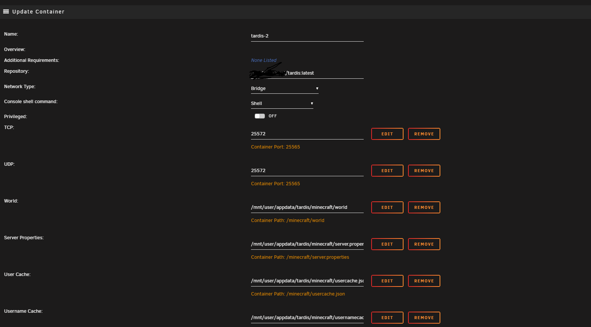

# Different Minecraft Mods: containerized servers

## Usage
This repository contains different Minecraft mods that you can self host with docker or using Unraid. The Docker file can be located within each mod.

## Pre Requisite
1. Java 1.8+
1. Technic Launcher (Or any launcher that accepts mods)
    - Forge Slate - 1.16.5
    - The Pixelmon Mod
2. Docker Desktop
3. Visual Studio Code
4. The latest versions of the mods

## Mods
1. Pixelmon 9.1.5
2. Tardis 1.5.4

## Running Locally
1. All Mods and other jars should be found in the folder respective folder.
2. Open up the specific mod folder in Visual Studio Code
3. Open up Docker Desktop
4. Right click on the docker file in Visual Studio Code and build the image. Make sure you are exposing the port that you want to use.
5. Once the image is built, go to Docker Desktop and you should see the image you just made. Click the play button and select "More options"
6. Add the same port to the TCP and UDP section that you want to expose.
7. Your server should be running locally now! 127.0.0.1:<PORT>
8. Go to Technic Launcher and download Forge Slate - 1.16.5 (Tardis) or The Pixelmon Mod (Pixelmon)
9. Before you click play, the mods that are in the server, make sure you add them to your client ( Go where your technic mods are ".technic\modpacks\<tardis or pixelmon>\mods" and add the jars you downloaded)
10. After you add the mods to your client, you can click "Play"

## UnRaid Configuration
 If you have an unraid server, this is how I have my container setup. 
 **Warning** I had to manually create the property and json files before creating the container. I also have my own private docker repository.

/minecraft/world
/mnt/user/appdata/tardis/minecraft/world

/minecraft/server.properties
/mnt/user/appdata/tardis/minecraft/server.properties

/minecraft/usercache.json
/mnt/user/appdata/tardis/minecraft/usercache.json

/minecraft/usernamecache.json
/mnt/user/appdata/tardis/minecraft/usernamecache.json

## Other Useful Information
To start the server run `docker-compose up -d` 

The server will be accessible at `<docker-host-ip>:25565` and the world folder will be copied to a `world` directory in the same folder as `docker-compose.yml`. The default server properties are provided, to run the server with custom server properties edit `server.properties`. This file must exist on the host otherwise docker compose cannot mount it to the container.

For more control over configuration: 

1) Build the image: `docker image build . -t your_mod_name_goes_here`
2) Run the server: `docker run -d -p 25565:25565 -p 25565:25565/udp your_mod_name_goes_here` or `docker run -d -25565:25565 -p 25565:25565/udp -v ./world:/minecraft/world your_mod_name_goes_here` to persist the world.

## Advanced Usage
The server files reside in `/minecraft`. These files include the following configuration and data files:
* server.properties
* banned_ips.txt
* banned_users.txt
* ops.txt
* white-list.txt
* config directory
* world directory

For more information on how to configure these files, refer to the Minecraft documentation.

**Warning**
If you neither volume mount a custom world directory, nor mount the existing world directory to a named docker volume, the world will be lost when the container is destroyed. If you would like to save the world created by the server, ensure to run the container with the world directory saved to a named volume.

Alternatively, use `docker-compose up -d` and docker compose will manage volumes for you.